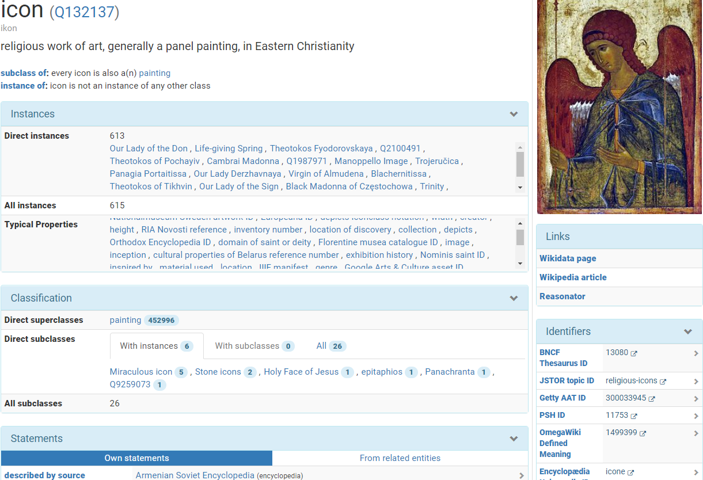
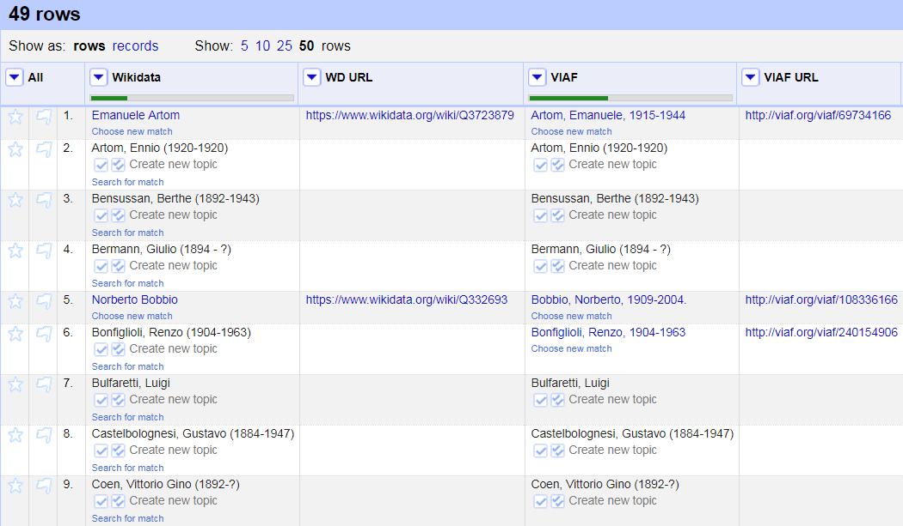
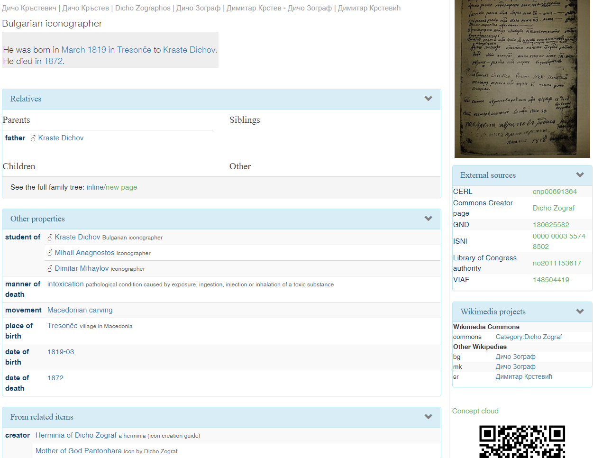
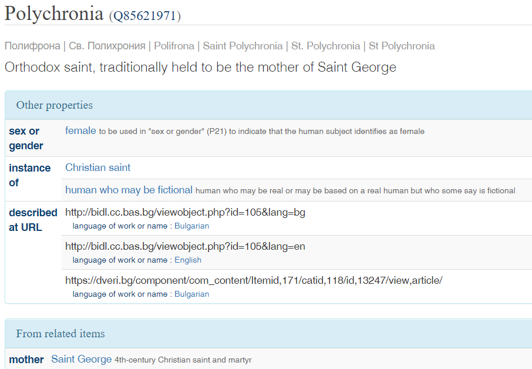
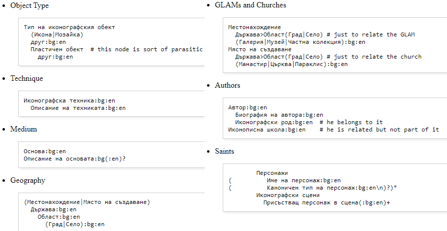
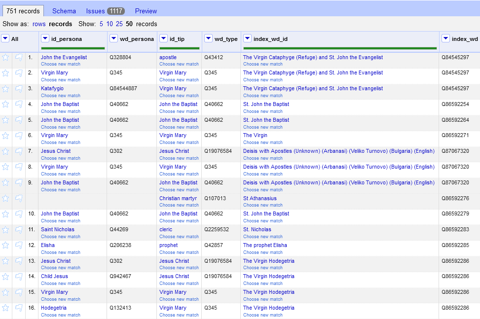
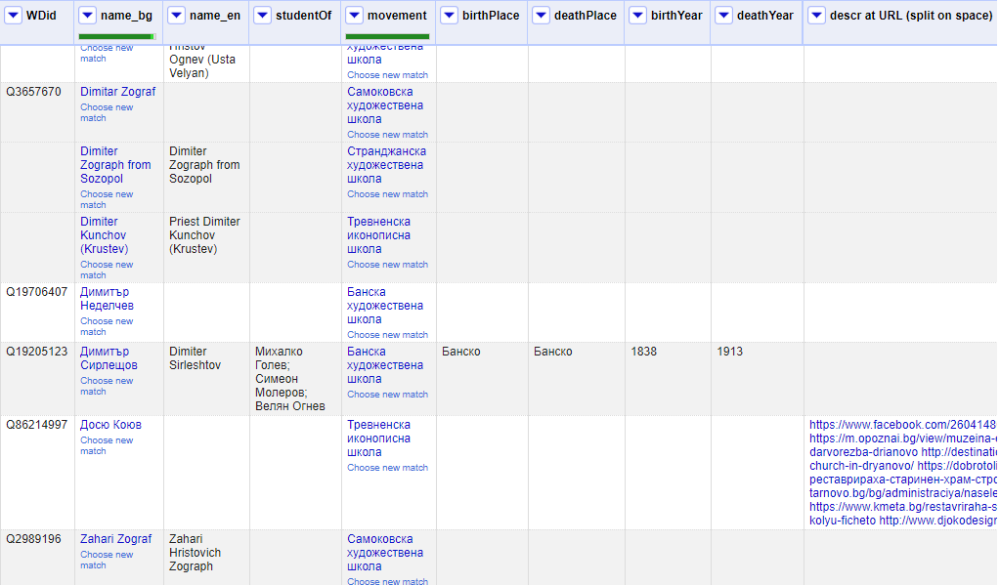
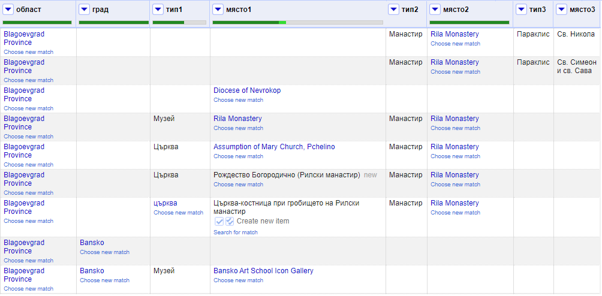
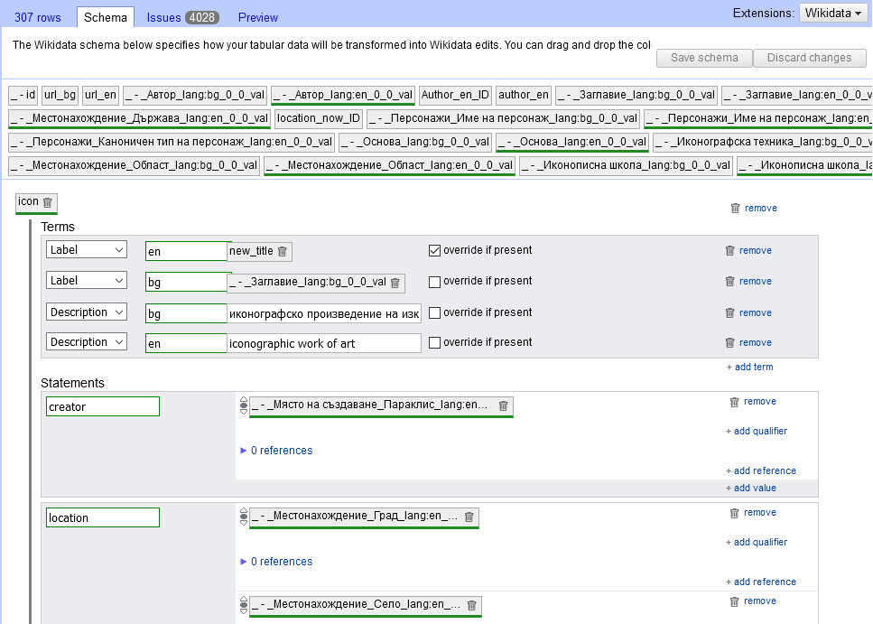
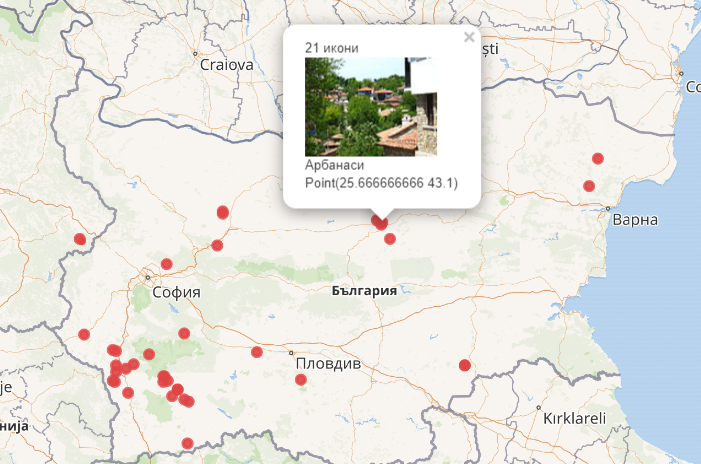

# Wikidata and GLAM

- Wikidata is one of the most important LOD datasets for GLAM
- It is also a Knowledge Graph platform for integrating and leveraging GLAM data
- [Wikidata Strategy 2019](https://meta.wikimedia.org/wiki/Wikidata/Strategy/2019) includes 3 parts, of which "Wikidata as a platform" is strongly GLAM-oriented
- Very strong [GLAM Wiki](https://outreach.wikimedia.org/wiki/GLAM) outreach including:
  - Case studies on [sharing Digital Collections](https://outreach.wikimedia.org/wiki/GLAM/Digital_collections) including Documenting 3D objects, Documenting living traditions, Digitization workflows, Enriching digitized content, Sharing and integrating digitized content
  - Advice on [Sharing Knowledge](https://outreach.wikimedia.org/wiki/GLAM/Sharing_Knowledge): Editathons, Workshops, Backstage Events, GLAM professionals contributing, Embedded Wikimedians, Online editing campaigns, Wikidata and institutional metadata, Embedding Wikimedia Content, GLAM + Education
- Numerous GLAM projects realized, including [Bulgarian State Archives case study](https://outreach.wikimedia.org/wiki/GLAM/Case_studies/Bulgarian_Archives_State_Agency)
- Wikipedian in Residence with institutions like British Library, Wales National Library, Europeana, etc etc

## Wikidata Project Visual Arts

[Wikidata:WikiProject Visual arts](https://www.wikidata.org/wiki/Wikidata:WikiProject_Visual_arts) (former name Sum of All Paintings):
- paintings: 451k ([query](https://w.wiki/VrS))
- paintings and subclasses thereof: 467k ([query](https://w.wiki/VrR))

Defined very rich metadata for various CH objects ([Item structure](https://www.wikidata.org/wiki/Wikidata:WikiProject_Visual_arts/Item_structure))

- eg "depicts Iconclass notation: 71H712"
  
Leads to a detailed description and classification using an Iconographic notation (in this case a typical Biblical situation)

- 71H71 David, from the roof (or balcony) of his palace, sees Bathsheba bathing
  - 71H712 Bathsheba attended by servant(s)
    - Bathsheba · David · Old Testament · Samuel-2 11-12 · balcony · bathing · bible · love at first sight · maidservant · palace · roof · spying

## Example Painting

- Example: [Batsheba (in Reasonator)](https://tools.wmflabs.org/reasonator/?lang=en&q=19863043)


## Icons: Current Status

- Only 623 icons on wikidata as of 3-Feb-2020: [tweet](https://twitter.com/valexiev1/status/1224274473186201608)
- 268 (43%) with image, 355 (47%) without: [query](https://w.wiki/GYn)
- 33% have no author, 46% is "anonymous", 20% are "noname" Masters, [Nikolaos_Tsafouris and Nikolaos_Zafouris should be merged](https://commons.wikimedia.org/wiki/Commons:Administrators%27_noticeboard/User_problems#merge_Nikolaos_Tsafouris_and_Nikolaos_Zafouris) on Commons: [query](https://w.wiki/GYi)


## Icons with Images ([query](https://w.wiki/GYo))


## Icon Class, Props ([SQID Q132137](https://tools.wmflabs.org/sqid/#/view?id=Q132137))



## Semantic Data Integration

- Dataset research, Data analysis
- Data cleaning
- Know Wikidata semantic model, propose new props if needed
- Data mapping/conversion (ETL)
- Coreferencing/matching/reconciliation: one of the most important steps
  - Match data instances across multiple datasets that refer to the same real-world entity
  - Fuzzy name matching (various algorithms), extra features, use machine learning for tuning weights
  - Reconciliation: matching tabular data ("strings") to a KG ("things")
- Data fusion: Gather attributes across datasets; select or aggregate
- Semantic text/metadata enrichment
- Data enrichment, inference, aggregation
- Sample queries; Semantic search, apps, visualizations

## Wikidata Mix-n-Match

[Mix-n-Match](https://mix-n-match.toolforge.org/): global authority control. As of 2-Jul-2020:

- 5181 `external-id` props that link to authority control databases ([query](https://w.wiki/Vra))
- 1627 with Mix-n-Match catalog ([query](https://w.wiki/Vre))
- 3554 without Mix-n-Match catalog (but easy to import/web-scrape)

Icon-related catalogs:

- [Iconclass](https://mix-n-match.toolforge.org/#/catalog/51), a multilingual classification system for cultural content (39.5k, 3.7k matched)
- [Getty Iconography Authority](https://mix-n-match.toolforge.org/#/catalog/2676) by Getty Research Institute (1.2k, 915 matched)
- [Iconografía Hispana](https://mix-n-match.toolforge.org/#/catalog/3247) Biblioteca Digital Hispánica (BDH) 
- [Brasiliana Iconográfica ID](https://mix-n-match.toolforge.org/#/catalog/1887) identifier for an artwork, in this database 
- [Trinidad and Tobago Icons](https://mix-n-match.toolforge.org/#/catalog/2421) National Institute of Higher Education, Research, Science and Technology (NIHERST) 

## Mix-n-Match: Iconclass and Getty IA


## Mix-n-Match: Corefs of Lucas Cranach


## OpenRefine Reconciliation

Reconciliation allows you to map strings to things.


## OpenRefine Recon: Wikidata and VIAF




# Icon Knowledge Graph Model

Made with [rdfpuml](https://github.com/VladimirAlexiev/rdf2rml): [icon-KG.ttl](icon-KG/icon-KG.ttl) -> [icon-KG.png](icon-KG/icon-KG.png) (control-click for full-screen)


## Adding Icon Concepts

- Icons involve many specific concepts for techniques, materials, subjects, and iconography (religuous subjects)
- These are described in "ерминии" (herminia, WD [Q3408234](https://www.wikidata.org/wiki/Q3408234)) which are "How to Guides" for icon painters
- We should deepen Getty AAT and WD with Bulgarian/Balkan-specific icon and ethnographic concepts

Example:

- Getty has only [AAT 300239260](http://www.getty.edu/vow/AATHierarchy?find=belt+buckle&logic=AND&note=&subjectid=300239260) "belt buckle" 
- Wikidata has more detail and is easier to add to than Getty.
- Wikidata has [WD Q25457974](https://www.wikidata.org/wiki/Q25457974) "Пафти": I added "subclass of: belt buckle", image
- Commons: [Belogradchik-hitorical-museum-19century-belt-buckle-14.jpg](https://commons.wikimedia.org/wiki/File:Belogradchik-hitorical-museum-19century-belt-buckle-14.jpg):
 - Added Structured metadata: depicts: pafta; location: Belogradchik History Museum

## Iconographer: Dicho Zograf

- One of most prolific iconographers: worked in tens of places, his icons are in hundreds of churches, and he made 2-10 thousands of icons.
- He also left 2 handwritten herminias ([Ерминия](https://bg.wikipedia.org/wiki/Ерминия): icon creation guide)
- His family tree is shown
- His work and legacy spanned 3 Balkan countries (BG, MK and SR: each claim him for their own):
  - He is Bulgarian: [Дичо Зограф](https://bg.wikipedia.org/wiki/%D0%94%D0%B8%D1%87%D0%BE_%D0%97%D0%BE%D0%B3%D1%80%D0%B0%D1%84) on bgwiki. Български иконописец, виден представител на Дебърската художествена школа.
  - He is Macedonian: [Дичо Зограф](https://mk.wikipedia.org/wiki/%D0%94%D0%B8%D1%87%D0%BE_%D0%97%D0%BE%D0%B3%D1%80%D0%B0%D1%84) on mkwiki. Годишно работел по околу педесет големи дела. Во нашите краишта го донел барокот кој доаѓал преку Света Гора и Солун, преку македонските мијачки зографи и резбари кои го учеле занаетот во манастирот “Зограф” на Атос.
  - He is Serbian: [Димитар Крстевић](https://sr.wikipedia.org/wiki/%D0%94%D0%B8%D0%BC%D0%B8%D1%82%D0%B0%D1%80_%D0%9A%D1%80%D1%81%D1%82%D0%B5%D0%B2%D0%B8%D1%9B) on srwiki. Био је иконописац и представник дебарске уметничке школе.

## Dicho Zograf's Icons

- The bgwiki article shows maybe 30 of his icons.
- Wikimedia commons has 56 of [Dicho Zograf's icons/paintings](https://commons.wikimedia.org/wiki/Category:Dicho_Zograf), CC Zero license
- This is less than 2% of his total works.
- But it's still significant: if we guesstimate 100 iconographers on WD and assume the average is *twice less*, that makes 2800 icons with cleared rights across Commons.


## Info on Commons Metadata and Wikidata

- The [info about an icon on Commons](https://commons.wikimedia.org/wiki/File:Church_of_the_Presentation_of_Virgin_Mary_Ku%C4%8Devi%C5%A1te_Dicho_Zograf_Jerusalim.jpg) is poor: author, date; title and place are embedded in the filename and cannot be extracted easily.
- The Structured Info (see second tab), eg Depicted, is empty.
- I would guess that none if these icons have a WD record.
- Dicho Zograf's WD item [Q12278833](https://www.wikidata.org/wiki/Q12278833) and [Commons Creator](https://commons.wikimedia.org/wiki/Creator:Dicho_Zograf) page  are also poor:
- Birth/death date/place and a bunch of identifiers, and links to Wikipedia pages, that's all

Enriched WD [Q12278833](https://www.wikidata.org/wiki/Q12278833) Dicho Zograf from bgwiki [Дичо Зограф](https://bg.wikipedia.org/wiki/%D0%94%D0%B8%D1%87%D0%BE_%D0%97%D0%BE%D0%B3%D1%80%D0%B0%D1%84) (added "!"):

- Дебърска художествена школа! (listed as "Macedonian carving" subclass of carving; I added class "painting movement")
- баща: зограф Кръсте Дичов Перков!
- учи се при: зографа Кръсте Дичов Перков!, а после при зографите Михаил Анагност! от Самарина! и сина му Димитър! (Михайлов).
- ерминията на Дичо Зограф: [Q84082005 Herminia of Dicho Zograf](https://www.wikidata.org/wiki/Q84082005)
  - collection [Q84082027 Slavic-Byzantium Research Center "Prof. Ivan Duichev"](https://www.wikidata.org/wiki/Q84082027), inventory number "Cod. D. Slavo 412"

## Editing Data About an Icon

- Първото дело на Дичо Зограф - [Q84296272](https://www.wikidata.org/wiki/Q84296272) Света Богородица Пантонхара, 1844
- от „Свети Йоан Богослов Канео“! (commissioned by)
- днес в Охридската галерия за икони! (collection)
- physical description: темпера, гипсен грунд на дъска, 57 х 41 х 4 cm
- described in article [Q84291564](https://www.wikidata.org/wiki/Q84291564) The icon of the Mother of God Pantonhara in the Icon Gallery, an article by Milco Georgievski 
  - published on 26 October 2014 in [Q84298592](https://www.wikidata.org/wiki/Q84298592) Ikonimaalari 2/2014 (ISBN 978-952-301-024-6)
    - Which is an issue of the Finnish journal on icons [Q84298370](https://www.wikidata.org/wiki/Q84298370) Ikonimaalari (ISSN 1455-7975)
  - English edition at academia.edu paper [9843052](https://www.academia.edu/9843052) The icon of the Mother of God Pantonhara in the Icon Gallery
  - proposed Wikidata prop [academia.edu work id](https://www.wikidata.org/wiki/Wikidata:Property_proposal/academia.edu_work_id) so we can link to academia.edu (in this case, it's the only source for that rare article)

## Iconographer: Dicho Zograf ([Q12278833](https://tools.wmflabs.org/reasonator/?&q=12278833))



## Multilingual: BG vs EN ([Q12278833](https://tools.wmflabs.org/reasonator/?q=Q12278833&lang=bg))


## Work: Herminia ([12278833](https://tools.wmflabs.org/reasonator/?&q=12278833))


## Institution: Ivan Duichev Center ([84082027](https://tools.wmflabs.org/reasonator/?&q=84082027))


## Icon: Mother of God Pantonhara ([Q84296272](https://tools.wmflabs.org/reasonator/?q=Q84296272&lang=en))


## Iconographic Subject: Pantonhara ([Q84306742](https://tools.wmflabs.org/reasonator/?q=Q84306742&lang=en))

- This is one of 282 [titles of Mary](https://tools.wmflabs.org/reasonator/?&q=1509831) (designation for Mary, mother of Jesus Christ)


## Iconography: Added 7 Saints in Order


## Added Saints

Mother and father of [St George](https://www.wikidata.org/wiki/Q48438): [Polychronia](https://www.wikidata.org/wiki/Q85621971) (Polifrona) and [Gerontius](https://www.wikidata.org/wiki/Q85622497), with references



## Added Names of Virgin Mary

Platitera ([Q84986979](https://reasonator.toolforge.org/?&q=84986979)): Platytera; Wider than Heavens, More Spacious than the Heavens; Св. Богородица Ширшая небес, По-широка от небесата 


## Saints: Added Bulgarian Descriptions


## Seven Slavic Saints: Added Membership


## Church (Commissioned by) ([Q164664](https://tools.wmflabs.org/reasonator/?&q=164664))


## Article (Described by source) ([Q84291564](https://tools.wmflabs.org/reasonator/?&q=84291564))


## Journal Issue (Published in) ([Q84298592](https://tools.wmflabs.org/reasonator/?&q=84298592))


## Journal (Part of the series) ([Q84298370](https://tools.wmflabs.org/reasonator/?&q=84298370))


# Bulgarian Icons

## Virtual Encyclopedia of Bulgarian Icons

[BAS IMI BIDL](http://bidl.cc.bas.bg/)


## BIDL Data

- Got 308 objects, custom XML
- However, don't have copyright clearance for the images
- This is unfortunate because Wikidata images use Wikimedia Commons, for centralized management
- Such images are very important in most visual applications
- There are many images of Balkan icons already in Commons
- The project [Structured Data on Commons](https://meta.wikimedia.org/wiki/Structured_Data_on_Commons) makes it easy for GLAM to describe CH images, using a Wikidata approach and linking to Wikidata for creator, location, depicted elements, etc
- Commons also supports DeepZoom (incl. GigaPixel), eg see [Montserrat Casas de Nieto, in Evening Dress](https://tools.wmflabs.org/zoomviewer/index.php?f=Ram%C3%B3n_Casas_-_Montserrat_Casas_de_Nieto,_in_Evening_Dress_-_Google_Art_Project.jpg)

## BIDL Schema

Deduced schema: about 60 elements:

```xml
#<?xml version="1.0" encoding="utf-8"?>
#<xml>
  <object id="\d+">
    <characteristics>
      Идентификация
        Заглавие:bg:en
        Тип на иконографския обект
          (Икона|Мозайка)
          друг:bg:en
          Пластичен обект
            друг:bg:en
        Автор:bg:en
          Биография на автора:bg:en
          Иконографски род:bg:en
        Иконописна школа:bg:en
        Период
          От
            (Година|Век)
              (начало|среда|край|първа половина|втора половина)
          До
            (Година|Век)
              (Месец|Ден)
              (начало|среда|край|първа половина|втора половина)
        Размери \(см\)
          височина
          ширина
          дебелина
        Местонахождение
          Държава:bg:en
          Област:bg:en
          (Град|Село):bg:en
          (Галерия|Музей|Частна колекция):bg:en
          Частна колекция
          Друго местонахождение:bg:en
        Място на създаване
          Държава:bg:en
          Област:bg:en
          (Град|Село):bg:en
          (Манастир|Църква|Параклис):bg:en
          Църква
          Друго място на създаване:bg:en
        Бележки към идентификацията на обекта:bg:en
      Описание
        Персонажи
(          Име на персонаж:bg:en
(          Каноничен тип на персонаж:bg:en\n)?)*
        Иконографски сцени
          Иконографска сцена:bg:en
          Присъстващ персонаж в сцена(:bg:en)+
        Описание на обекта:bg(:en)?
      Технология
        Иконографска техника:bg:en
          Описание на техниката:bg:en
        Основа:bg:en
          Описание на основата:bg(:en)?
        Състояние, реставрационни намеси и коментари((:bg)?:en)?
      Файлове
    <files>
      <file
```

## BIDL Authorities



## BIDL Authority Mapping

- Lots of nested well-structured info, eg "Местонахождение> Държава> Област> Село> Манастир"
  - Has to be flattened out for Europeana, eg concatenated to a single field `dct:spatial`
- Great opportunity for semantic enrichment, see *highlights* below. 
  - Donated about 1395 to the *Poganovo monastery* by *Empress Elena Paleologus*, daughter of the monastery's sposor *Despot Deyan* and granddaughter of *Tsar Ivan Alexander*.
  - *Dimiter T. Molerov*, born in 1780 in *Bansko*, son of *Toma Vishanov the Moler*. One of the best-known painters, a representative of the *Bansko* school of art, a disciple of his father, influenced by the art of *Athos*. Author of the murals of the naos in the *St Archangels' paraclete* (параклис) in the *Rila monastery*, the murals in the *Church of the Assumption of the Virgin* in the *Pchelino dependance* (метох)
- Mapped to Wikidata:
  - Iconographic object type (instance of): WD and AAT
  - Personages/saints (depicts)
  - Iconographers (creator)
  - Iconographic schools (artistic movement)
  - Location of creation (comissioned by), current location

## OpenRefine: Reconcile Personages



## OpenRefine: Reconcile Iconographers



## OpenRefine: Reconcile Locations



## OpenRefine: Mapping Icons to Wikidata



Only a small part is shown

## Mapping BIDL to Wikidata: Results

- OpenRefine was used to reconcile BIDL authorities to Wikidata
- OpenRefine Wikidata schema was used to map the data
- The mapped data was exported as QuickStatements and added to Wikidata
- Saints and iconographers were added semi-automatically
- All 308 icons are in WD according to the KG model (but we don't have data about publications)

# Sample Wikidata Queries

## WD [Query](https://w.wiki/Goj): Depicted Subjects by Popularity


## WD [Query](https://w.wiki/Tci): Icons by Type


## Queries Can Be Modified by Non-Experts 


## WD [Query](https://w.wiki/Gon): Icons by Current Location


## WD [Query](https://w.wiki/Tcm): Count by Location of Creation

We know the location and coordinates for 169 of 308 icons




# EDM Mapping

- Detailed and precise EDM mapping including bilingual data, lang tags, links to Wikidata.
- Implemented as a Python script using rdflib, ElementTree.
-  Converts XML, adds Wikidata references from CSV.

## EDM: CHO 1
CHO, Type, Title, Creator, Size, Date, Locations

```ttl
<http://bidl.cc.bas.bg/viewobject.php?id=264&lang=bg> a edm:ProvidedCHO;
  owl:sameAs wd:Q87103221;
  edm:hasType wd:Q132137;
  edm:type "IMAGE";
  dc:identifier "264";
  dc:title
    "Преображение Господне"@bg,
    "The Transfiguration of Jesus Christ"@en;
  dc:type "Икона"@bg, wd:Q132137;
  dc:creator
    "Тома Вишанов-Молера"@bg, "Toma Vishanov-Molera"@en, wd:Q12296667,
    "Банска иконописна школа"@bg, "Bansko Iconographic School"@en, wd:Q12272944;
  dct:created "От край на 18 Век До начало на 19 Век"@bg;
  dct:extent "30.5 x 22.5 x 2.3 cm";
  edm:currentLocation
    "Успение Богородично, Бобошево, Благоевград, България"@bg,
    "The Assumption of the Virgin, Boboshevo, Blagoevgrad, Bulgaria"@en,
    wd:Q12297283;
  dct:provenance
    "Успение Богородично, Бобошево, Благоевград, България"@bg,
    "The Assumption of the Virgin, Boboshevo, Blagoevgrad, Bulgaria"@en,
    wd:Q12297283;
  dct:spatial
    "Успение Богородично, Бобошево, Благоевград, България"@bg,
    "The Assumption of the Virgin, Boboshevo, Blagoevgrad, Bulgaria"@en,
    wd:Q12297283.
```

## EDM: CHO 2
Description, Subject, Medium, Part Of, Language

```ttl
<http://bidl.cc.bas.bg/viewobject.php?id=264&lang=bg>
  dc:description
    """В горната половина на композицията са изобразени: в центъра Христос в цял ръст
... старозаветните пророци Мойсей и Илия, седнали. 
... вляво св. ап. Яков, клекнал и опрял ръце в земята; св. ап. Петър.."""@bg,
    """Pictured in the upper half of the composition are: in the center - Christ in full length..."""@en;
  dc:subject
    "Апостол"@bg, "Apostle"@en, wd:Q43412,
    "Иисус Христос"@bg, "Jesus Christ"@en, wd:Q302,
    "Преображение Господне"@bg, "The Transfiguration of Jesus Christ"@en,
    "Пророк"@bg, "Prophet"@en, wd:Q42857,
    "Св. Илия"@bg, "St. Elijah"@en, wd:Q133507,
    "Св. Йоан Богослов"@bg, "St. John the Evangelist"@en, wd:Q328804,
    "Св. Моисей"@bg, "St. Moses"@en, wd:Q9077,
    "Св. Петър"@bg, "St. Peter"@en, wd:Q33923,
    "Св. Яков"@bg, "St. James"@en, wd:Q43999;
  dct:medium
    """Маслена/Дърво. Приложена е маслена живопис..."""@bg,
    """Oil/Wood. Oil painting, laid thinly on the ground coat..."""@en,
    wd:Q56676227, wd:Q287;
  dct:isPartOf
    "Virtual encyclopaedia of Bulgarian iconography"@en,
    "Виртуална енциклопедия на Българската иконография"@bg,
    <http://bidl.cc.bas.bg/index.php?lang=bg>;
  edm:rights <https://creativecommons.org/publicdomain/mark/1.0/>;
  dc:language "bg", "en".
```

## EDM: Auxiliary Objects
Aggregation, Providers, Webpage, Image, License, Agent

```ttl
<http://bidl.cc.bas.bg/viewobject.php?id=264&lang=bg#aggr> a ore:Aggregation;
  edm:aggregatedCHO <http://bidl.cc.bas.bg/viewobject.php?id=264&lang=bg>;
  edm:isShownAt <http://bidl.cc.bas.bg/viewobject.php?id=264&lang=bg>,
                <http://bidl.cc.bas.bg/viewobject.php?id=264&lang=en>;
  edm:isShownBy <http://bidl.cc.bas.bg/view/300-view.jpg>;
  edm:dataProvider "Институт по математика и информатика, БАН";
  edm:intermediateProvider "CLADA BG";
  edm:provider "Bulgariana".

<http://bidl.cc.bas.bg/view/300-view.jpg> a edm:WebResource;
  edm:rights <http://rightsstatements.org/vocab/InC/1.0/>.

wd:Q12296667 a edm:Agent;
  skos:prefLabel "Тома Вишанов-Молера"@bg, "Toma Vishanov-Molera"@en;
  dct:isPartOf
    "Молеров"@bg, "Molerov"@en,
    "Банска иконописна школа"@bg, "Bansko Iconographic School"@en, wd:Q12272944;
  skos:note
    """Тома Вишанов-Молера – роден около 1750г., иконописец и стенописец, 
основоположник на банската художествена школа. Израства в семейството на свещеника Вишан..."""@bg,
    """Toma Vishanov-Molera, born around 1750, painter of icons and murals, 
founder of the Bansko school of art. He grew up in the family of the clergyman Vishan..."""@en.
```
